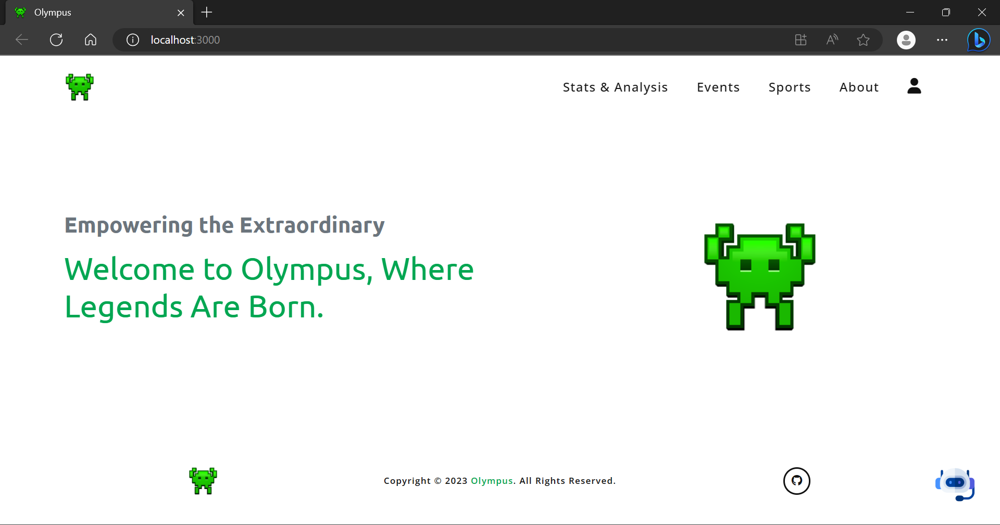
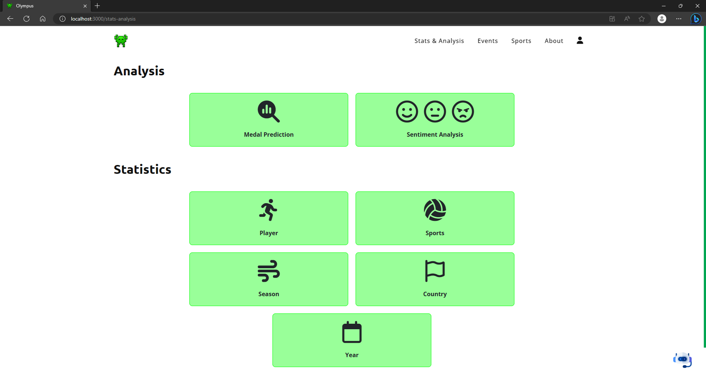
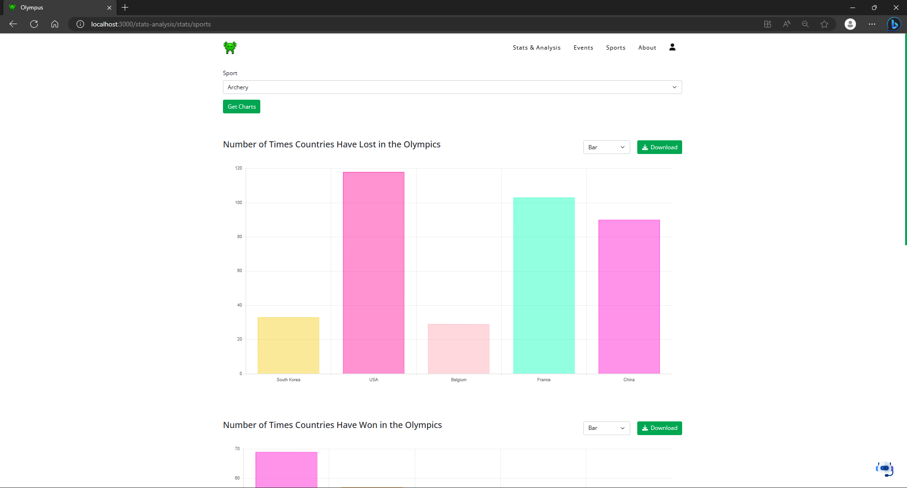
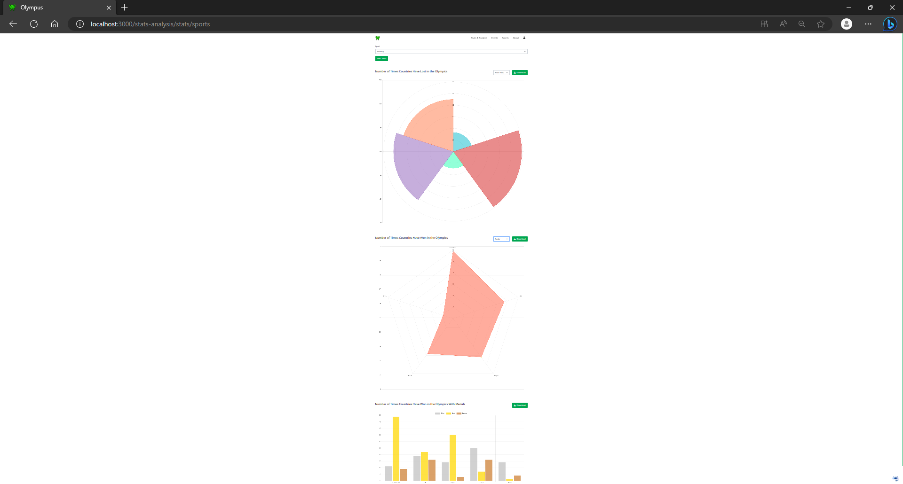
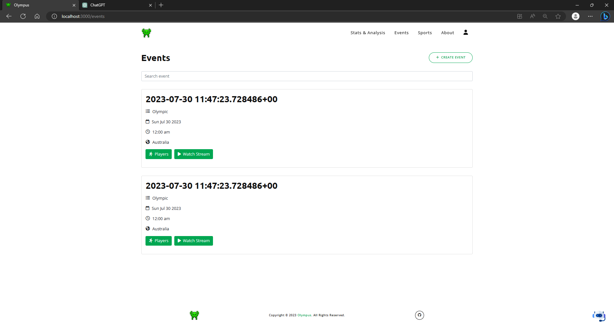
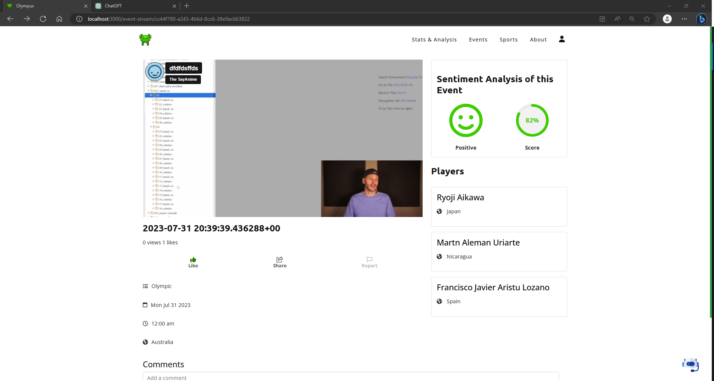
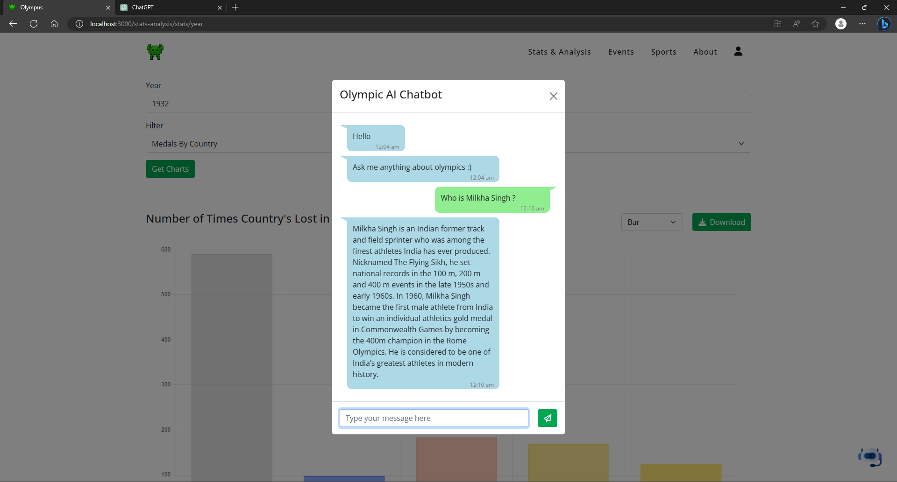

# Geek-Olympic Hackathon Project


## Introduction

Welcome to our Geek-Olympic Hackathon project! This submission aims to enhance the Olympics experience for users and organizers through a web-based application that offers various exciting features. We have utilized the provided Olympic dataset along with other data from the internet to create a feature-rich platform for Olympic enthusiasts.

## Project Overview

Our web-based application, **Geek-Olympic WebApp**, provides users with an interactive interface to stream various Olympic events and engage with them in a fun manner. It incorporates the following key features:

1. **Live Streaming & Interaction**: We have integrated Vimeo, a live-streaming platform, to broadcast ongoing events. Users can interact with the live stream through comments, like events, and view multiple ongoing events simultaneously.

2. **Predictive Analysis**: Our system includes a prediction model based on Sklearn's Gradient Boosting Classifier. This model predicts the likelihood of an athlete winning a medal based on various attributes, such as age, height, weight, gender, sport, country, and the season of the Olympics. While the model's accuracy is approximately 45%, it provides valuable insights into athletes' performances.

3. **Sentiment Analyzer**: To gauge public sentiment during the event, we have implemented a sentiment analysis model based on Hugging Face's pretrained roBERTa model (cardiffnlp/twitter-roberta-base-sentiment). The sentiment analyzer processes tweets related to the Olympics, providing an overall accuracy of around 67% and an average f1 score of 0.635.

4. **Interactive Charts**: We have utilized various plotting types, including pie charts, bar plots, radar plots, line plots, and doughnut plots, to provide users with a better understanding of the Olympics data and enhance their overall experience.

5. **Authentication & Data Protection**: To ensure a smooth and secure user experience, we have integrated Auth0 for authentication, authorization, and data protection of our users.

6. **Chat Bot Assistance**: Our platform features a chatbot powered by the GPT-3 model to assist users with their queries and provide helpful information.

## Tech Stack

The project is built using the following technologies:

- Backend: Python with Fast API as the web framework
- Database: CockroachDB (Serverless Cloud Instance)
- Frontend: React for the user interface
- Live Streaming Platform: Vimeo for broadcasting events
- Authentication: Auth0 for secure user access
- Prediction Model: Sklearn's Gradient Boosting Classifier
- Sentiment Analysis Model: Hugging Face's pretrained roBERTa model (cardiffnlp/twitter-roberta-base-sentiment)

## Environment Files Setup


### The steps to add the environment files and the root.crt file are as follows:

- api/auth/.env: Create a file named .env inside the api/auth/ directory. Add the necessary configuration variables for the API and Auth0 in this file.

- streaming/.env: Create a file named .env inside the streaming/ directory. Add the required configurations for the Vimeo live streaming platform in this file.

- .env: Create a file named .env in the project's root directory. Add the DB_USERNAME & PASSWORD.

- models/server.env: Create a file named server.env inside the models/ directory. Add the specific environment variables required for the predictive and sentiment analysis models.

- CockroachDB Signing Key (root.crt): Place the root.crt file inside the certs/ directory. This ensures secure communication with the CockroachDB.

- Please ensure that you add all the necessary configurations to these environment files to avoid any issues while running the Geek-Olympic WebApp.


## Achievements

Throughout the development process, we achieved notable results:

- The predictive model using Sklearn's Gradient Boosting Classifier achieved an accuracy of approximately 45% with both an f1-score and precision score of 0.53.

- The sentiment analysis model using roBERTa achieved an overall accuracy of around 67%, an average f1 score of 0.635, an average recall score of 0.652, and an average precision score of 0.671.

# Video

https://github.com/Cosmicoppai/Geek-a-Thon/assets/63765823/46c827ba-fb7c-48e7-ad41-0028a891f90f


## ScreenShots









For more screenshots, [click here](./screenshots/).
## Run
- Backend
```
pip install -r ./requirements.txt
py main.py
```
- Frontend
```
npm i
npm start
```


## Acknowledgments

We would like to express our gratitude to the organizers of the Geek-Olympic Hackathon for providing us with this opportunity to work on such an exciting project.


Thank you for exploring our Geek-Olympic WebApp! We hope you enjoy the enhanced Olympics experience it provides. Happy hacking and happy Olympics! 🏅🎉
